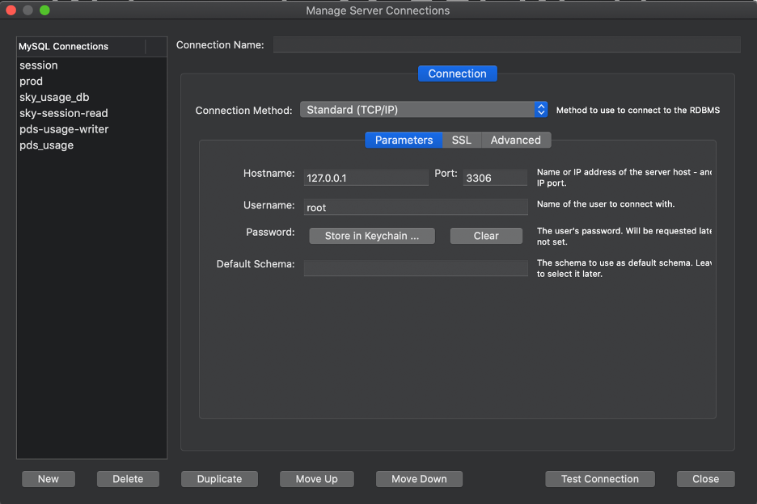
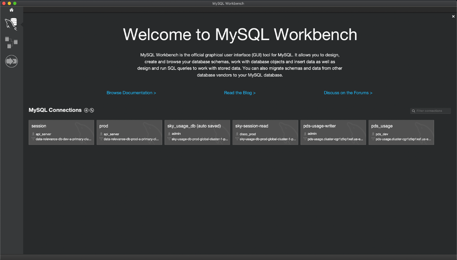

## How to install MySQL server community edition
1. Download mysql community server
    * [windows](https://dev.mysql.com/downloads/file/?id=496745)
    * [Mac](https://dev.mysql.com/downloads/file/?id=497036)

1.  Double click on just downloaded executable and follow installation wizard

Tips: in the installation processs, wizard will ask you set up password for root user, please password in safe play, it will be used later.

## How to install MySQLWorkbench

1.  Download mysql server binary from below url
    * [Windows](https://dev.mysql.com/downloads/file/?id=497505)
    * [Mac](https://dev.mysql.com/downloads/file/?id=497518)

1.	Double click on just downloaded executable, and follow installation wizard to install MySQLWorkbench on your machine.

After you installed Mysql Workbench, you can launch it and you will see below interface.
 

 
And it will ask you to input your root password. Then you will see below interface with no connections. Click on + sign right after MySQL Connectdions to add a connection to 127.0.0.1, you set a connection name as “discord”

